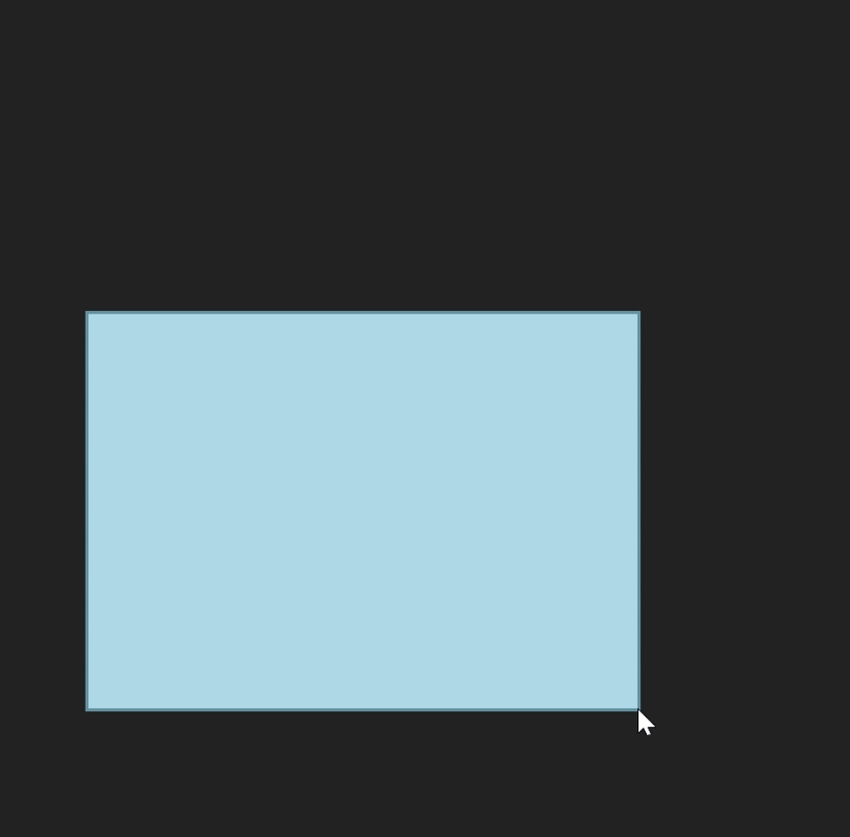

# Selection-Box
I made a simple visual representation of the selection-box that is used on windows when selecting multiple files, or selection multiple icons on the desktop  
I made it in Java, for it to work all the java files are needed. It works just like a regular selection-box, following your mouse.

